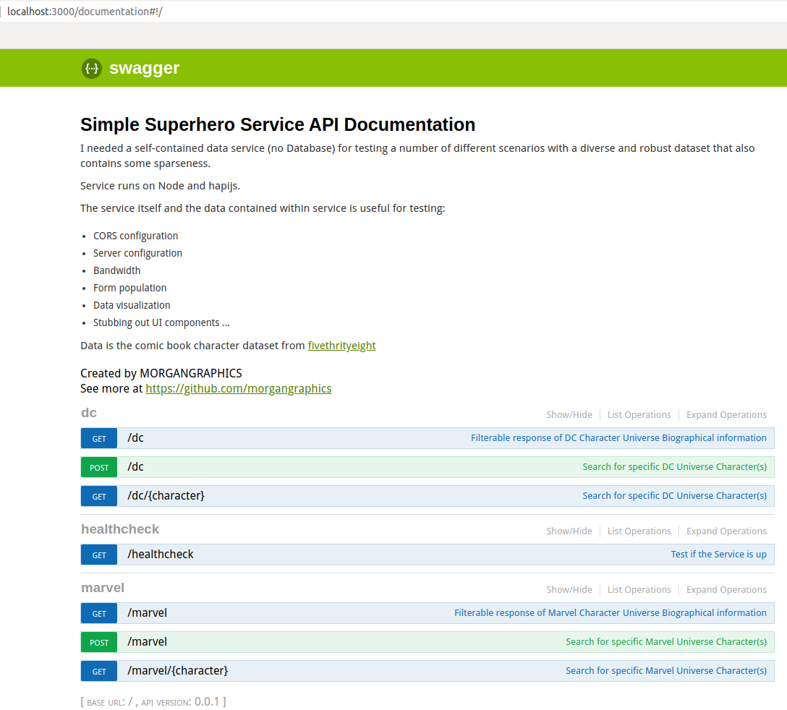

# Simple Superhero Service

```bash

            ██████  ██▓ ███▄ ▄███▓ ██▓███   ██▓    ▓█████
          ▒██    ▒ ▓██▒▓██▒▀█▀ ██▒▓██░  ██▒▓██▒    ▓█   ▀
          ░ ▓██▄   ▒██▒▓██    ▓██░▓██░ ██▓▒▒██░    ▒███
            ▒   ██▒░██░▒██    ▒██ ▒██▄█▓▒ ▒▒██░    ▒▓█  ▄
          ▒██████▒▒░██░▒██▒   ░██▒▒██▒ ░  ░░██████▒░▒████▒
          ▒ ▒▓▒ ▒ ░░▓  ░ ▒░   ░  ░▒▓▒░ ░  ░░ ▒░▓  ░░░ ▒░ ░
          ░ ░▒  ░ ░ ▒ ░░  ░      ░░▒ ░     ░ ░ ▒  ░ ░ ░  ░
          ░  ░  ░   ▒ ░░      ░   ░░         ░ ░      ░
                ░   ░         ░                ░  ░   ░  ░

  ██████  █    ██  ██▓███  ▓█████  ██▀███   ██░ ██ ▓█████  ██▀███   ▒█████
▒██    ▒  ██  ▓██▒▓██░  ██▒▓█   ▀ ▓██ ▒ ██▒▓██░ ██▒▓█   ▀ ▓██ ▒ ██▒▒██▒  ██▒
░ ▓██▄   ▓██  ▒██░▓██░ ██▓▒▒███   ▓██ ░▄█ ▒▒██▀▀██░▒███   ▓██ ░▄█ ▒▒██░  ██▒
  ▒   ██▒▓▓█  ░██░▒██▄█▓▒ ▒▒▓█  ▄ ▒██▀▀█▄  ░▓█ ░██ ▒▓█  ▄ ▒██▀▀█▄  ▒██   ██░
▒██████▒▒▒▒█████▓ ▒██▒ ░  ░░▒████▒░██▓ ▒██▒░▓█▒░██▓░▒████▒░██▓ ▒██▒░ ████▓▒░
▒ ▒▓▒ ▒ ░░▒▓▒ ▒ ▒ ▒▓▒░ ░  ░░░ ▒░ ░░ ▒▓ ░▒▓░ ▒ ░░▒░▒░░ ▒░ ░░ ▒▓ ░▒▓░░ ▒░▒░▒░
░ ░▒  ░ ░░░▒░ ░ ░ ░▒ ░      ░ ░  ░  ░▒ ░ ▒░ ▒ ░▒░ ░ ░ ░  ░  ░▒ ░ ▒░  ░ ▒ ▒░
░  ░  ░   ░░░ ░ ░ ░░          ░     ░░   ░  ░  ░░ ░   ░     ░░   ░ ░ ░ ░ ▒
      ░     ░                 ░  ░   ░      ░  ░  ░   ░  ░   ░         ░ ░

          ██████ ▓█████  ██▀███   ██▒   █▓ ██▓ ▄████▄  ▓█████
        ▒██    ▒ ▓█   ▀ ▓██ ▒ ██▒▓██░   █▒▓██▒▒██▀ ▀█  ▓█   ▀
        ░ ▓██▄   ▒███   ▓██ ░▄█ ▒ ▓██  █▒░▒██▒▒▓█    ▄ ▒███
          ▒   ██▒▒▓█  ▄ ▒██▀▀█▄    ▒██ █░░░██░▒▓▓▄ ▄██▒▒▓█  ▄
        ▒██████▒▒░▒████▒░██▓ ▒██▒   ▒▀█░  ░██░▒ ▓███▀ ░░▒████▒
        ▒ ▒▓▒ ▒ ░░░ ▒░ ░░ ▒▓ ░▒▓░   ░ ▐░  ░▓  ░ ░▒ ▒  ░░░ ▒░ ░
        ░ ░▒  ░ ░ ░ ░  ░  ░▒ ░ ▒░   ░ ░░   ▒ ░  ░  ▒    ░ ░  ░
        ░  ░  ░     ░     ░░   ░      ░░   ▒ ░░           ░
              ░     ░  ░   ░           ░   ░  ░ ░         ░  ░
                                      ░       ░


```

[](https://lgtm.com/projects/g/morgangraphics/simple-superhero-service/alerts/)
[](https://lgtm.com/projects/g/morgangraphics/simple-superhero-service/context:javascript)

I needed a self-contained, data service (no Database) for testing a number of different scenarios with a diverse and robust dataset that also contains some sparseness.

Service runs on Node and Hapi.js.

The service itself and the data contained within service may be useful for testing:

*   CORS configuration
*   Server configuration
*   Bandwidth
*   Form population
*   Data visualization
*   Stubbing out UI components
*   ...

## Service



### Requirements
node.js (12+)

pm2 `npm install pm2`

### Installation
1.  Clone the repo `git clone https://github.com/morgangraphics/simple-superhero-service.git`
1.  cd into the directory and install node.js requirements `npm install`
1.  Generate a self signed cert `openssl req -new -newkey rsa:4096 -x509 -sha256 -days 365 -nodes -out sss-cert.pem -keyout sss-key.pem -days 365`
1.  Rename the `config/default.example.yaml` file to `config/default.yaml`
1.  Update the ``<PLACEHOLDERS>`` according to your setup
1.  `npm run service` (production like with pm2) or `npm run dev` (development) or `npm run tests` (testing)
1.  The self-signed certs will make the browser throw a `Potential Security Risk` error. Select the Advanced button/link and `Accept the risk and continue` button/link

Marvel URL: [](https://localhost:3000/marvel)

DC URL: [](https://localhost:3000/dc)

Swagger Interface: [](https://localhost:3000/documentation#!/)

## Dataset

Data is the comic book character dataset from [@fivethrityeight](https://github.com/fivethirtyeight/data/tree/master/comic-characters)
> This folder contains data behind the story Comic Books Are Still Made By Men, For Men And About Men.
>
> The data comes from Marvel Wikia and DC Wikia. Characters were scraped on August 24. Appearance counts were scraped on September 2. The month and year of the first issue each character appeared in was pulled on October 6.
>
> The data is split into two files, for DC and Marvel, respectively: dc-wikia-data.csv and marvel-wikia-data.csv.

Read more about it here: [https://datahub.io/five-thirty-eight/comic-characters#readme](https://datahub.io/five-thirty-eight/comic-characters#readme)

#### Number of characters

| Marvel  | DC     |
|---------|--------|
|  16,376 | 6,896  |

#### Data types

| Variable         | Type    | Definition                                                                                                                                   |
|------------------|---------|----------------------------------------------------------------------------------------------------------------------------------------------|
| page_id          | integer | The unique identifier for that characters page within the wikia                                                                              |
| name             | string  | The name of the character                                                                                                                    |
| urlslug          | string  | The unique url within the wikia that takes you to the character                                                                              |
| id               | string  | The identity status of the character (Secret Identity, Public identity, \[on marvel only: No Dual Identity\])                                |
| align            | string  | If the character is Good, Bad or Neutral                                                                                                     |
| eye              | string  | Eye color of the character                                                                                                                   |
| hair             | string  | Hair color of the character                                                                                                                  |
| sex              | string  | Sex of the character (e.g. Male, Female, etc.)                                                                                               |
| gsm              | string  | If the character is a gender or sexual minority (e.g. Homosexual characters, bisexual characters)                                            |
| alive            | string  | If the character is alive or deceased                                                                                                        |
| appearances      | integer | The number of appearances of the character in comic books <sup>*</sup>                                                                       |
| first appearance <sup>**</sup> | string  | The month and year of the character’s first appearance in a comic book, if available                                           |
| year           | integer | The year of the character’s first appearance in a comic book, if available                                                                     |

<sup>\* as of Sep. 2, 2014. Number will become increasingly out of date as time goes on</sup>

<sup>\** `first appearance` date formatting can be different </sup>

#### Example Output
```json
# Example DC Output:
[
  {
    "page_id": 1422,
    "name": "batman (bruce wayne)",
    "urlslug": "/wiki/batman_(bruce_wayne)",
    "id": "secret identity",
    "align": "good characters",
    "eye": "blue eyes",
    "hair": "black hair",
    "sex": "male characters",
    "gsm": null,
    "alive": "living characters",
    "appearances": 3093,
    "first appearance": "1939, may",
    "year": 1939
  }
]

# Example Marvel Output:
[
  {
    "page_id": 1678,
    "name": "spider-man (peter parker)",
    "urlslug": "/spider-man_(peter_parker)",
    "id": "secret identity",
    "align": "good characters",
    "eye": "hazel eyes",
    "hair": "brown hair",
    "sex": "male characters",
    "gsm": null,
    "alive": "living characters",
    "appearances": 4043,
    "first appearance": "aug-62",
    "year": 1962
  }
]
```

### Retrieving Data `/marvel` or `/dc`

The base endpoints allow for retrieving data and applying a series of filters to that data to accomplish whatever you need with an array or JSON objects. They can be used in combination with one another

:warning: THIS IS NOT A DATABASE! Nor is it intended to be. It's primary purpose is to be self contained. As such traditional ANSI SQL like queries with will not work. However, I've approximated some of SQL's functionality.

#### Filter options
| Variable Name | Variable | Default  | Description                                                                                                            |
|---------------|----------|----------|------------------------------------------------------------------------------------------------------------------------|
| format        | format   | json     | Output format (currently only JSON)                                                                                    |
| headers       | h        | all      | Available Columns (page_id, name, urlslug, id, align, eye, hair, sex, gsm, alive, appearances, first appearance, year) |
| help *        | help     | false    | Display Help                                                                                                           |
| limit         | limit    | 100      | Limit results (0 = unlimited)                                                                                          |
| nulls         | nulls    | first    | When sorting, null values show up first or last depending e.g. \[null, 1, 2, 3\] or \[1, 2, 3, null\] †                |
| pretty *      | pretty   | false    | Pretty print JSON results                                                                                              |
| prune *       | prune    | false    | Prune null values from result sets                                                                                     |
| random * **   | random   | false    | Retrieve a random number of characters based on limit                                                                  |
| seed * **     | seed     | false    | Keep the random number of characters consistent between requests                                                       |
| sort          | s        | unsorted | Sort response asc or desc e.g.s=name,appearances:desc                                                                  |

<sup>\* Shorthand query parameter, meaning its presence automatically equates to true</sup>

<sup>\** Only available on /{character} endpoints</sup>

<sup>† Does not apply when sorting on column/header which contains a null value, records with null values are removed</sup>


##### Examples
`curl -X GET --header 'Accept: application/json' 'https://localhost:3000/dc?pretty&limit=3&s=name:asc'`
```json
[
    {
        "page_id": 1422,
        "name": "batman (bruce wayne)",
        "urlslug": "/wiki/batman_(bruce_wayne)",
        "id": "secret identity",
        "align": "good characters",
        "eye": "blue eyes",
        "hair": "black hair",
        "sex": "male characters",
        "gsm": null,
        "alive": "living characters",
        "appearances": 3093,
        "first appearance": "1939, may",
        "year": 1939
    },
    {
        "page_id": 1458,
        "name": "green lantern (hal jordan)",
        "urlslug": "/wiki/green_lantern_(hal_jordan)",
        "id": "secret identity",
        "align": "good characters",
        "eye": "brown eyes",
        "hair": "brown hair",
        "sex": "male characters",
        "gsm": null,
        "alive": "living characters",
        "appearances": 1565,
        "first appearance": "1959, october",
        "year": 1959
    },
    {
        "page_id": 23387,
        "name": "superman (clark kent)",
        "urlslug": "/wiki/superman_(clark_kent)",
        "id": "secret identity",
        "align": "good characters",
        "eye": "blue eyes",
        "hair": "black hair",
        "sex": "male characters",
        "gsm": null,
        "alive": "living characters",
        "appearances": 2496,
        "first appearance": "1986, october",
        "year": 1986
    }
]
```

`curl -X GET --header 'Accept: application/json' 'https://localhost:3000/dc?h=name,appearances&pretty&limit=3&s=name:asc'`
```json
[
    {
        "name": "batman (bruce wayne)",
        "appearances": 3093
    },
    {
        "name": "green lantern (hal jordan)",
        "appearances": 1565
    },
    {
        "name": "superman (clark kent)",
        "appearances": 2496
    }
]
```

`curl -X GET --header 'Accept: application/json' 'https://localhost:3000/marvel/spider+man,-woman/?pretty&s=name:asc'`
```json
[
    {
        "page_id": 1678,
        "name": "spider-man (peter parker)",
        "urlslug": "/spider-man_(peter_parker)",
        "id": "secret identity",
        "align": "good characters",
        "eye": "hazel eyes",
        "hair": "brown hair",
        "sex": "male characters",
        "gsm": null,
        "alive": "living characters",
        "appearances": 4043,
        "first appearance": "aug-62",
        "year": 1962
    },
    {
        "page_id": 336259,
        "name": "spiderman (1940s) (earth-616)",
        "urlslug": "/spiderman_(1940s)_(earth-616)",
        "id": "secret identity",
        "align": "bad characters",
        "eye": null,
        "hair": "white hair",
        "sex": "male characters",
        "gsm": null,
        "alive": "deceased characters",
        "appearances": 1,
        "first appearance": "dec-46",
        "year": 1946
    },
    {
        "page_id": 15388,
        "name": "strongman (spider-squad) (earth-616)",
        "urlslug": "/strongman_(spider-squad)_(earth-616)",
        "id": null,
        "align": null,
        "eye": null,
        "hair": null,
        "sex": null,
        "gsm": null,
        "alive": "living characters",
        "appearances": 1,
        "first appearance": "aug-77",
        "year": 1977
    },
    {
        "page_id": 117593,
        "name": "vern (spider-man) (earth-616)",
        "urlslug": "/vern_(spider-man)_(earth-616)",
        "id": null,
        "align": null,
        "eye": null,
        "hair": null,
        "sex": "male characters",
        "gsm": null,
        "alive": "living characters",
        "appearances": 2,
        "first appearance": "jun-08",
        "year": 2008
    }
]
```

`curl -X GET --header 'Accept: application/json' 'https://localhost:3000/marvel/spider+man,-woman/?pretty&s=name:asc&prune'`
```json
[
    {
        "page_id": 1678,
        "name": "spider-man (peter parker)",
        "urlslug": "/spider-man_(peter_parker)",
        "id": "secret identity",
        "align": "good characters",
        "eye": "hazel eyes",
        "hair": "brown hair",
        "sex": "male characters",
        "alive": "living characters",
        "appearances": 4043,
        "first appearance": "aug-62",
        "year": 1962
    },
    {
        "page_id": 336259,
        "name": "spiderman (1940s) (earth-616)",
        "urlslug": "/spiderman_(1940s)_(earth-616)",
        "id": "secret identity",
        "align": "bad characters",
        "hair": "white hair",
        "sex": "male characters",
        "alive": "deceased characters",
        "appearances": 1,
        "first appearance": "dec-46",
        "year": 1946
    },
    {
        "page_id": 15388,
        "name": "strongman (spider-squad) (earth-616)",
        "urlslug": "/strongman_(spider-squad)_(earth-616)",
        "alive": "living characters",
        "appearances": 1,
        "first appearance": "aug-77",
        "year": 1977
    },
    {
        "page_id": 117593,
        "name": "vern (spider-man) (earth-616)",
        "urlslug": "/vern_(spider-man)_(earth-616)",
        "sex": "male characters",
        "alive": "living characters",
        "appearances": 2,
        "first appearance": "jun-08",
        "year": 2008
    }
]
```

`curl -X GET --header 'Accept: application/json' 'https://localhost:3000/marvel?help'`
```text
format     | format  | json     | Output format (currently only JSON)
headers    | h       | all      | Available Columns (page_id, name, urlslug, id, align, eye, hair, sex, gsm, alive, appearances, first appearance, year)
           |         |          |
           |         |          | Variable          | Definition
           |         |          | ------------------|----------------
           |         |          | page_id           | The unique identifier for that characters page within the wikia
           |         |          | name              | The name of the character
           |         |          | urlslug           | The unique url within the wikia that takes you to the character
           |         |          | id                | The identity status of the character (Secret Identity, Public identity, [on marvel only: No Dual Identity])
           |         |          | align             | If the character is Good, Bad or Neutral
           |         |          | eye               | Eye color of the character
           |         |          | hair              | Hair color of the character
           |         |          | sex               | Sex of the character (e.g. Male, Female, etc.)
           |         |          | gsm               | If the character is a gender or sexual minority (e.g. Homosexual characters, bisexual characters)
           |         |          | alive             | If the character is alive or deceased
           |         |          | appearances       | The number of appearances of the character in comic books *
           |         |          | first appearance  | The month and year of the character’s first appearance in a comic book, if available
           |         |          | year              | The year of the character’s first appearance in a comic book, if available
           |         |          |
help       | help    | false    | Display Help
limit      | limit   | 100      | Limit results ( 0 = unlimited)
nulls      | nulls   | first    | null values sorted first or last e.g. [null, 1, 2, 3] or [1, 2, 3, null] †
pretty     | pretty  | false    | Pretty print JSON results
prune      | prune   | false    | Remove null values from output
random     | random  | false    | Array of random characters based on limit
seed       | seed    | false    | Keep the same random characters on multiple requests
sort       | s       | unsorted | Sort response asc|desc e.g. s=name,appearances:desc

* (as of Sep. 2, 2014. Number will become increasingly out of date as time goes on.)
† Does not apply when sorting on column/header which contains a null value, records with null values are removed
```

`curl -X GET --header 'Accept: application/json' 'https://localhost:3000/dc?limit=2&random&seed'`
```json
[{"page_id":127398,"name":"cassandra cartland (new earth)","urlslug":"/wiki/cassandra_cartland_(new_earth)","id":"","align":"bad characters","eye":"green eyes","hair":"brown hair","sex":"female characters","gsm":"","alive":"living characters","appearances":6,"first appearance":"1997, february","year":1997},{"page_id":192282,"name":"poltergeist (new earth)","urlslug":"/wiki/poltergeist_(new_earth)","id":"","align":"bad characters","eye":"blue eyes","hair":"black hair","sex":"male characters","gsm":"","alive":"living characters","appearances":1,"first appearance":"1996, december","year":1996}]
```

In many cases where there are multiple characters with the same name (in alternative story lines) the first result is usually the "Original" character. That is how the data is structured. However, you might want to specifically target a character or characters by using the search filters.

`curl -X GET --header 'Accept: application/json' 'https://localhost:3000/marvel/spider+man,-woman,-616?pretty'`

This request is looking for a character name that contains both "spider" AND 'man' BUT NOT "woman" or '616'
```json
[
    {
        "page_id": 1678,
        "name": "spider-man (peter parker)",
        "urlslug": "/spider-man_(peter_parker)",
        "id": "secret identity",
        "align": "good characters",
        "eye": "hazel eyes",
        "hair": "brown hair",
        "sex": "male characters",
        "gsm": null,
        "alive": "living characters",
        "appearances": 4043,
        "first appearance": "aug-62",
        "year": 1962
    }
]
```

### Posting Data `/marvel` or `/dc`

character: character can be a string, or an array of strings (preferred) e.g.
```json
 {
   "character": "spider-man,iron man"
 }

 OR

 {
   "character": ["spider-man", "iron man"]
 }
```

h: h can be a string, or an array of strings (preferred) e.g.
```json
 {
   "h": "name,appearances,year"
 }

 OR

 {
   "h": ["name", "appearances", "year"]
 }
```

s: can be a string, an object, array of strings, or an array of objects (preferred) e.g.
```json
{
  "s": "name:asc,appearances:desc"
}

OR

{
  "s": {
     "column": "name",
     "sort": "asc"
   }
}

OR

{
  "s": ["name:asc", "appearances:desc"]
}

OR

{
  "s": [
    { "column": "name", "sort": "asc" },
    { "column": "appearances", "sort": "desc" }
  ]
}
```

`curl -X POST --header 'Content-Type: application/json' --header 'Accept: application/json' -d '{
  "format": "json",
  "character": [
    "spider man"
  ],
  "h": [
    "name",
    "appearances",
    "year"
  ],
  "limit": 100,
  "pretty": true,
  "s": [
    {
      "column": "name",
      "sort": "asc"
    }
  ]
}' 'https://localhost:3000/marvel'
`

```json
[
  {
    "name": "spider-man (peter parker)",
    "appearances": 4043,
    "year": 1962
  },
  {
    "name": "spiderman (1940s) (earth-616)",
    "appearances": 1,
    "year": 1946
  },
  {
    "name": "vern (spider-man) (earth-616)",
    "appearances": 2,
    "year": 2008
  }
]
```

### Getting Data `/marvel/{character}` or `/dc/{character}`

Character names can have a bit of variation which can be a bit inconsistent between story lines. The official name for Spider-man contains a dash, however, other variants can be Spiderman, Spider man, in addition to Spider-man. The service attempts to use permutation to generate different spellings depending on how the name is entered. If you are unsure, leave a space e.g. `spider man` and the service will search for `spider-man, spiderman, and spider man`

`curl -X GET --header 'Accept: application/json' 'https://localhost:3000/marvel/spider%20man/?pretty'`

```json
[
    {
        "page_id": 1678,
        "name": "spider-man (peter parker)",
        "urlslug": "/spider-man_(peter_parker)",
        "id": "secret identity",
        "align": "good characters",
        "eye": "hazel eyes",
        "hair": "brown hair",
        "sex": "male characters",
        "gsm": null,
        "alive": "living characters",
        "appearances": 4043,
        "first appearance": "aug-62",
        "year": 1962
    },
    {
        "page_id": 117593,
        "name": "vern (spider-man) (earth-616)",
        "urlslug": "/vern_(spider-man)_(earth-616)",
        "id": null,
        "align": null,
        "eye": null,
        "hair": null,
        "sex": "male characters",
        "gsm": null,
        "alive": "living characters",
        "appearances": 2,
        "first appearance": "jun-08",
        "year": 2008
    },
    {
        "page_id": 336259,
        "name": "spiderman (1940s) (earth-616)",
        "urlslug": "/spiderman_(1940s)_(earth-616)",
        "id": "secret identity",
        "align": "bad characters",
        "eye": null,
        "hair": "white hair",
        "sex": "male characters",
        "gsm": null,
        "alive": "deceased characters",
        "appearances": 1,
        "first appearance": "dec-46",
        "year": 1946
    }
]
```
Filters work the same as the base endpoint. (Excluding `random` and `seed`)

`curl -X GET --header 'Accept: application/json' 'https://localhost:3000/marvel/iron%20man/?pretty&s=year:desc'`

```json
[
    {
        "page_id": 753403,
        "name": "zola iron man (earth-616)",
        "urlslug": "/zola_iron_man_(earth-616)",
        "id": "secret identity",
        "align": "bad characters",
        "eye": "black eyes",
        "hair": "no hair",
        "sex": "male characters",
        "gsm": null,
        "alive": "living characters",
        "appearances": 1,
        "first appearance": null,
        "year": null
    },
    {
        "page_id": 639805,
        "name": "iron man (sentient armor) (earth-616)",
        "urlslug": "/iron_man_(sentient_armor)_(earth-616)",
        "id": "public identity",
        "align": "neutral characters",
        "eye": "white eyes",
        "hair": "no hair",
        "sex": "agender characters",
        "gsm": null,
        "alive": "deceased characters",
        "appearances": 4,
        "first appearance": "mar-00",
        "year": 2000
    },
    {
        "page_id": 755268,
        "name": "iron man (taskmaster robot) (earth-616)",
        "urlslug": "/iron_man_(taskmaster_robot)_(earth-616)",
        "id": "secret identity",
        "align": "bad characters",
        "eye": null,
        "hair": null,
        "sex": "agender characters",
        "gsm": null,
        "alive": "living characters",
        "appearances": 1,
        "first appearance": "oct-98",
        "year": 1998
    },
    {
        "page_id": 235195,
        "name": "white dragon (iron man) (earth-616)",
        "urlslug": "/white_dragon_(iron_man)_(earth-616)",
        "id": "secret identity",
        "align": "bad characters",
        "eye": null,
        "hair": "black hair",
        "sex": "male characters",
        "gsm": null,
        "alive": "deceased characters",
        "appearances": 2,
        "first appearance": "jul-71",
        "year": 1971
    },
    {
        "page_id": 1868,
        "name": "iron man (anthony \"tony\" stark)",
        "urlslug": "/iron_man_(anthony_%22tony%22_stark)",
        "id": "public identity",
        "align": "good characters",
        "eye": "blue eyes",
        "hair": "black hair",
        "sex": "male characters",
        "gsm": null,
        "alive": "living characters",
        "appearances": 2961,
        "first appearance": "mar-63",
        "year": 1963
    }
]
```

`curl -X GET --header 'Accept: application/json' 'https://localhost:3000/marvel/iron%20man/?pretty&s=year:desc&nulls=last'`

```json
[
    {
        "page_id": 639805,
        "name": "iron man (sentient armor) (earth-616)",
        "urlslug": "/iron_man_(sentient_armor)_(earth-616)",
        "id": "public identity",
        "align": "neutral characters",
        "eye": "white eyes",
        "hair": "no hair",
        "sex": "agender characters",
        "gsm": null,
        "alive": "deceased characters",
        "appearances": 4,
        "first appearance": "mar-00",
        "year": 2000
    },
    {
        "page_id": 755268,
        "name": "iron man (taskmaster robot) (earth-616)",
        "urlslug": "/iron_man_(taskmaster_robot)_(earth-616)",
        "id": "secret identity",
        "align": "bad characters",
        "eye": null,
        "hair": null,
        "sex": "agender characters",
        "gsm": null,
        "alive": "living characters",
        "appearances": 1,
        "first appearance": "oct-98",
        "year": 1998
    },
    {
        "page_id": 235195,
        "name": "white dragon (iron man) (earth-616)",
        "urlslug": "/white_dragon_(iron_man)_(earth-616)",
        "id": "secret identity",
        "align": "bad characters",
        "eye": null,
        "hair": "black hair",
        "sex": "male characters",
        "gsm": null,
        "alive": "deceased characters",
        "appearances": 2,
        "first appearance": "jul-71",
        "year": 1971
    },
    {
        "page_id": 1868,
        "name": "iron man (anthony \"tony\" stark)",
        "urlslug": "/iron_man_(anthony_%22tony%22_stark)",
        "id": "public identity",
        "align": "good characters",
        "eye": "blue eyes",
        "hair": "black hair",
        "sex": "male characters",
        "gsm": null,
        "alive": "living characters",
        "appearances": 2961,
        "first appearance": "mar-63",
        "year": 1963
    },
    {
        "page_id": 753403,
        "name": "zola iron man (earth-616)",
        "urlslug": "/zola_iron_man_(earth-616)",
        "id": "secret identity",
        "align": "bad characters",
        "eye": "black eyes",
        "hair": "no hair",
        "sex": "male characters",
        "gsm": null,
        "alive": "living characters",
        "appearances": 1,
        "first appearance": null,
        "year": null
    }
]
```

## License

MIT / BSD

## Author Information

dm00000 via MORGANGRAPHICS, INC
